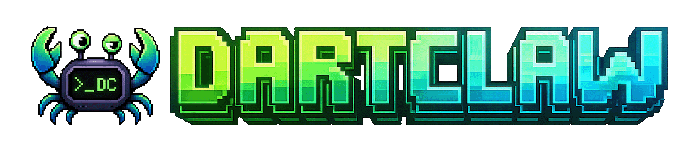
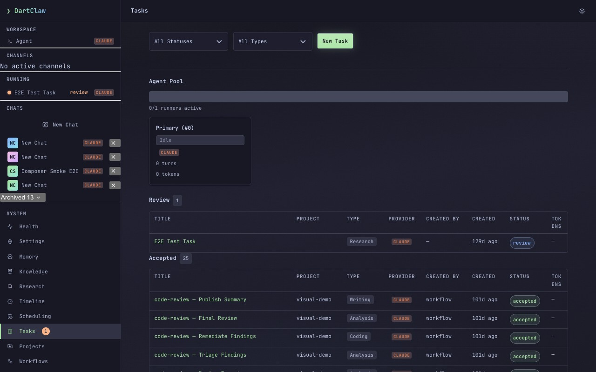

<p align="center">
  
</p>

# DartClaw

_Agentic powers. No supply-chain roulette. Secure by design._

**DartClaw turns coding agents into a persistent, security-conscious personal AI – equal parts assistant, context engine, and software factory.** A single AOT-compiled Dart binary hosts Claude Code, Codex, or any ACP-compliant agent and equips it with long-term memory and a citation-backed Context Engine, chat access via WhatsApp, Signal, and Google Chat, scheduled jobs and background tasks, logical-agent conversations, and end-to-end coding workflows – all driven from a full web UI, REST API, and CLI. Real security boundaries – container isolation, a fail-closed guard chain, credential isolation, runtime governance – stand between agents and your system. And the supply chain won't keep you up at night: no Node.js, no npm, a dependency list short enough to audit, every asset compiled into the binary, and a bundled SQLite as the only native companion. What you install is exactly what runs.

> [!NOTE]
> DartClaw is **experimental** (soft-published, pre-alpha) – breaking changes are expected while the core matures.
>
> _Status_: 0.23.0 – design-system refinement, Web UI polish, and runtime hardening. See [CHANGELOG](CHANGELOG.md).

<p align="center">
  
</p>

## Why DartClaw?

- **One self-contained binary** – AOT-compiled Dart, zero Node.js/npm. Web UI, templates, skills, and workflow definitions ship *inside* the binary; a bare install serves everything with no asset downloads and no network access at startup.
- **Any agent, one runtime** – Claude Code (JSONL) and Codex (JSON-RPC) are first-class harnesses, and any ACP-compliant agent (Goose, Mistral Vibe, …) plugs in through configuration alone. One canonical tool policy applies across all providers.
- **Secure by design, not by prompt** – defense-in-depth with container isolation (`network:none`), a fail-closed guard chain, a credential proxy that keeps API keys out of the container, audit logging, and content classification. Boundaries live in the OS and the host, not in the system prompt.
- **Your AI, on your phone** – WhatsApp, Signal, and Google Chat channels with DM/group access control, mention gating, and thread-bound task sessions. **Crowd coding**: a group chat collaboratively steers a shared agent session.
- **It remembers** – the Context Engine maintains an LLM-curated wiki, a temporal knowledge graph, and long-term memory, synthesized into compact citation-backed packets served to agents over MCP (`context_research`) – browsable in the web UI's read-only Knowledge Hub with a point-in-time timeline. Hybrid FTS5/QMD search across all of it.
- **A software factory** – built-in `spec-and-implement`, `plan-and-implement`, and `code-review` YAML workflows take work from spec to reviewed code, plus custom workflows triggered from chat, web forms, or GitHub PR webhooks. Run server-backed or fully server-less, with approval gates, live CLI progress, and per-step token accounting.
- **Task orchestration** – background tasks with review queues, task types, goals, git worktrees, and per-task provider overrides; bounded per-provider worker capacity runs mixed providers in parallel.
- **Scheduled autonomy** – heartbeat and cron jobs with configurable delivery: morning briefings, nightly reflection, a knowledge inbox – see the [recipes](docs/guide/recipes/README.md).
- **Runtime governance** – admin senders, per-sender rate limits, daily token budgets, loop detection, and `/stop` / `/pause` / `/resume` emergency controls.
- **Agent conversations & outbound MCP** – agents start or continue provider-independent logical-agent sessions through `sessions_spawn` and `sessions_send`, while external MCP traffic crosses a guard-mediated, audited egress boundary.
- **Operable from anywhere** – full web UI (HTMX, SSE streaming), REST API, and a CLI covering serve, sessions, tasks, runners, workflow, jobs, projects, service, and more ([CLI reference](docs/guide/cli-reference.md)).

## Installation

### Homebrew (macOS & Linux) – recommended

Homebrew installs the self-contained prebuilt `dartclaw` binary, with no Dart toolchain required. Prebuilt binaries are published for **macOS** (Apple Silicon and Intel) and **Linux** (x64 and arm64):

```bash
brew tap DartClaw/dartclaw
brew install dartclaw
dartclaw --version
```

Then point DartClaw at a provider and start the server:

```bash
export ANTHROPIC_API_KEY="sk-ant-..."   # or run: claude auth login
dartclaw init
dartclaw serve
# Open http://127.0.0.1:3333
```

You also need at least one agent CLI (`claude` or `codex`) installed – see [Prerequisites](#prerequisites). For full setup and provider auth, see [Getting Started](docs/guide/getting-started.md).

### Windows x64 – Scoop or PowerShell

Via [Scoop](https://scoop.sh):

```powershell
scoop bucket add dartclaw https://github.com/DartClaw/scoop-dartclaw
scoop install dartclaw/dartclaw
```

Or via the checksum-verifying PowerShell installer, which installs under `%LOCALAPPDATA%\Programs\DartClaw` and adds
its `bin` directory to your user `PATH` (re-run it to upgrade):

```powershell
irm https://raw.githubusercontent.com/DartClaw/dartclaw/main/install.ps1 | iex
# Open a new terminal, then:
dartclaw --version
```

See the [Windows guide](docs/guide/windows.md) for upgrade commands, provider setup, smoke validation, and the explicit
limits around container isolation, Bash steps, channel sidecars, and provider sandboxes.

### From source (any platform)

On a platform without a prebuilt binary, or for development and `--dev` hot-reload workflows, build the standalone binary from a checkout (requires the Dart SDK – see [Prerequisites](#prerequisites)):

```bash
git clone <repo-url> && cd dartclaw
dart pub get
bash dev/tools/build.sh
./build/bin/dartclaw init
./build/bin/dartclaw serve
```

The build produces `build/bin/dartclaw` next to a `build/lib/` holding the bundled SQLite library; keep the two directories together when relocating. The standalone `dartclaw` binary is the recommended runtime entrypoint; use `dart run dartclaw_cli:dartclaw ...` only for source-based development and `--dev` hot-reload workflows.

### Prerequisites

- **Agent CLI** – at least one: `claude` (Claude Code) or `codex` (OpenAI Codex CLI)
- **API key** – `ANTHROPIC_API_KEY` (Claude) and/or `CODEX_API_KEY` (Codex CLI – primary; `OPENAI_API_KEY` is accepted as a legacy fallback)
- **Docker** – optional, for container isolation
- **Dart SDK** >= 3.13.0 – source builds only; the prebuilt binaries need no Dart toolchain
- **SQLite** – bundled with the prebuilt binaries and source builds

## How it works

Two layers with a hard trust boundary between them:

- **Dart host** – state (file-based + SQLite), HTTP API, web UI, security policy, scheduling, channels, task orchestration, runtime governance
- **Agent runtime** – reasoning, tool execution, bash commands (in per-type Docker containers or as a host process)

```
                                                          ┌─── claude binary (JSONL over stdio)
User ─→ HTTP / WhatsApp / Signal / Google Chat ─→ Dart Host ─→ Guards ─→ Container ─┼─── codex binary (JSON-RPC)
                                                  │                      │           └─── ACP agents (Goose, Vibe, …)
                                            Guard Chain            network:none
                                            Audit Logger         Credential Proxy
                                           Content Guard          Mount Allowlist
                                           Rate Limiter
                                           Loop Detector
```

The host drives every provider through one `AgentHarness` interface, so guards, tool policy, and orchestration behave identically whether the worker underneath is Claude Code, Codex, or an ACP agent. See [Architecture](docs/guide/architecture.md) for the full picture.

## Security Model

Defense-in-depth with multiple independent layers:

1. **Container isolation** – Docker `network:none`, `--cap-drop ALL`, read-only root, mount allowlist; unavailable on native Windows, where enabling it fails closed with POSIX/WSL remediation
2. **Credential isolation** – multi-provider credentials via `CredentialRegistry`; API keys on Unix socket, never in container env
3. **Guard chain** – command, file, network, content guards operating on canonical tool names (provider-agnostic, fail-closed)
4. **Content-guard** – LLM classification at agent boundaries
5. **Runtime governance** – per-sender rate limiting, token budgets, loop detection; `/stop` emergency kill
6. **HTTP auth** – token-based + session cookies
7. **System prompt safety rules** – injected every turn, not overridable

Without Docker, guards serve as the primary boundary (pragmatic mode for development).

## Configuration

DartClaw uses `dartclaw.yaml` with typed config sections, and behavior files for agent personality:

```yaml
# dartclaw.yaml
server:
  port: 3000
agent:
  provider: claude
credentials:
  anthropic: ${ANTHROPIC_API_KEY}
```

Behavior files in `~/.dartclaw/workspace/`: `SOUL.md`, `AGENTS.md`, `USER.md`, `TOOLS.md`, `MEMORY.md`, and `HEARTBEAT.md`. See [Configuration guide](docs/guide/configuration.md) for the full reference.

## Documentation

### User Guide ([full index](docs/guide/README.md))
- **[Getting Started](docs/guide/getting-started.md)** – installation, first run, overview
- **[Windows](docs/guide/windows.md)** – native Windows x64 installation, validation, and capability limits
- **[Configuration](docs/guide/configuration.md)** – `dartclaw.yaml` reference, typed config sections, environment variables
- **[CLI Operations](docs/guide/cli-operations.md)** / **[CLI Reference](docs/guide/cli-reference.md)** – connected vs standalone mode, authentication, every command and flag
- **[Workspace](docs/guide/workspace.md)** – behavior files, memory, prompt assembly
- **[Security](docs/guide/security.md)** – guards, containers, credential proxy, canonical tool taxonomy
- **[Governance](docs/guide/governance.md)** – admin senders, rate limits, token budgets, loop detection, emergency controls
- **[Tasks](docs/guide/tasks.md)** – task orchestration, review workflow, coding tasks, provider overrides
- **[Workflows](docs/guide/workflows.md)** – authoring guide, trigger surfaces, built-in workflows ([YAML reference](docs/guide/workflows-reference.md))
- **[Agents](docs/guide/agents.md)** – logical-agent sessions, provider selection, model selection, shared worker capacity
- **[Channels](docs/guide/whatsapp.md)** – [WhatsApp](docs/guide/whatsapp.md) / [Signal](docs/guide/signal.md) / [Google Chat](docs/guide/google-chat.md) setup and access control
- **[Scheduling](docs/guide/scheduling.md)** – heartbeat, cron jobs
- **[Search & Memory](docs/guide/search.md)** – search agent, FTS5/QMD hybrid search
- **[Projects & Git](docs/guide/projects-and-git.md)** – project directory, worktrees, branch management
- **[Deployment](docs/guide/deployment.md)** – LaunchDaemon, systemd, egress firewall
- **[Customization](docs/guide/customization.md)** – L1-L5 customization ladder

### Recipes ([index](docs/guide/recipes/README.md))
- **[Personal Assistant](docs/guide/recipes/00-personal-assistant.md)** – turnkey setup: briefings + journaling + research + reflection
- **[Crowd Coding](docs/guide/recipes/08-crowd-coding.md)** – multi-user collaborative AI agent steering via chat
- [Morning Briefing](docs/guide/recipes/01-morning-briefing.md) / [Daily Journal](docs/guide/recipes/02-daily-memory-journal.md) / [Task Queue](docs/guide/recipes/03-scheduled-task-queue.md) / [Knowledge Inbox](docs/guide/recipes/04-knowledge-inbox.md) / [CRM Tracker](docs/guide/recipes/05-contact-crm-tracker.md) / [Research Assistant](docs/guide/recipes/06-research-assistant.md) / [Nightly Reflection](docs/guide/recipes/07-nightly-reflection.md)

### SDK Guide
- **[Quick Start](docs/sdk/quick-start.md)** – build your first agent in under 30 lines
- **[Package Guide](docs/sdk/packages.md)** – which package to depend on
- **[Concepts](docs/sdk/concepts.md)** – harnesses, turns, events, sessions, guards, storage, and channels
- **[Architecture](docs/sdk/architecture.md)** – the SDK-facing 2-layer model and extension seams
- **[Security](docs/sdk/security.md)** – guard chains, isolation expectations, credentials, and audit hooks
- **[Examples](examples/sdk/)** – runnable SDK example projects

### Architecture & Specs
- **[Architecture](docs/guide/architecture.md)** – 2-layer model, multi-provider, design decisions
- **[Architecture Governance](dev/architecture/architecture-governance.md)** – contributor-facing executable boundary checks via `dev/tools/arch_check.dart`
- **[Web UI & API](docs/guide/web-ui-and-api.md)** – interface features, REST endpoints, provider status API

## Project Structure

```
apps/
  dartclaw_cli/                 AOT-compilable CLI app – serve, workflow, tasks, sessions, runners,
                                jobs, projects, service, deploy, and more (see CLI reference)
packages/
  dartclaw/                     Published umbrella – re-exports core + models + storage
  dartclaw_core/                Harness, protocol adapters, guards, channels, agents, scheduling, governance (sqlite3-free)
  dartclaw_models/              Pure data classes: Session, Message, SessionKey (zero deps)
  dartclaw_storage/             SQLite3-backed: MemoryService, SearchDb, FTS5/QMD, pruner
  dartclaw_server/              HTTP API (Shelf), web UI (HTMX/Trellis), SSE, tasks, turns
  dartclaw_config/              Config parsing, typed sections, extension registration
  dartclaw_security/            Guard implementations, input sanitizer, content classifier
  dartclaw_workflow/            Workflow definitions, registry, parser/validator, and execution support
  dartclaw_whatsapp/            WhatsApp channel (GOWA sidecar)
  dartclaw_signal/              Signal channel (signal-cli sidecar)
  dartclaw_google_chat/         Google Chat channel (Workspace Events + Pub/Sub)
  dartclaw_testing/             Shared test fakes and utilities
docs/                           User guide and SDK guide
dev/                            Contributor / agent docs, dev tools, testing profiles
```

Dart pub workspace – all packages share dependencies and resolve locally.

## Development

```bash
dart pub get
dart run dev/tools/embed_assets.dart   # required after cloning: generates the embedded asset libraries lib/ imports
dart analyze
dart test packages/dartclaw_core
dart test packages/dartclaw_server
dart test apps/dartclaw_cli
dart format --line-length=120 .
```

On hosts that can load the bundled `sqlite3` native asset, the server and CLI test suites run without manual SQLite
setup. The integration-tagged e2e suite is opt-in:
`dart test --run-skipped -t integration apps/dartclaw_cli/test/e2e/server_builder_integration_test.dart`.
Contributor docs – architecture deep-dives, guidelines, testing profiles, and dev tooling – live under [`dev/`](dev/).

## Inspirations & influences

Born from spending too much time wrangling AI agents and wondering why the tooling keeps making the same mistakes. These projects and people shaped how DartClaw thinks about the problem:

- **[OpenClaw](https://github.com/OpenAgentsInc/openclaw)** and **[NanoClaw](https://github.com/cyanheads/nanoclaw)** – two earlier agent runtimes whose architectures, trade-offs, and battle scars directly informed DartClaw's design
- **Cole Medin** – his work on building agentic systems and especially his case for building your own agent runtime rather than depending on ever-shifting frameworks. DartClaw exists partly because of that argument
- **Daniel Miessler** – creator of PAI and a relentless voice for treating AI security as real security, not vibes. The defense-in-depth model here owes a debt to that thinking
- **[claude_agent_sdk](https://github.com/nshkrdotcom/claude_agent_sdk)** – early exploration of driving the Claude Code binary directly via JSONL, which validated the approach DartClaw's harness is built on

## License

MIT
